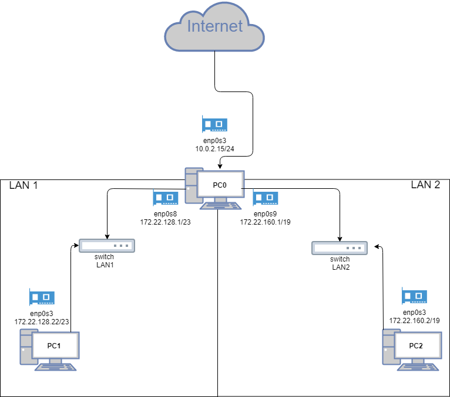

# Rozwiązanie 
### 1. W pliku ```/etc/network/interfaces``` dodać ### 
##### PCO
* enp0s8 (bez)
	* auto enp0s8
	* iface enp0s8 inet static
	* address 172.22.160.1
	* netmask 255.255.254.0
* enp0s9 (bez)
	* auto enp0s9
	* iface enp0s9 inet static
	* address 172.22.128.1
	* netmask 255.255.224.0
##### PC1
* enp0s3 (bez)
	* auto enp0s3
	* iface enp0s3 inet static
	* address 172.22.160.2
	* netmask 255.255.254.0
	* up ip route add default via 172.22.160.1
##### PC2
* enp0s3 (bez)
	* auto enp0s3
	* iface enp0s3 inet static
	* address 172.22.128.2
	* netmask 255.255.224.0
	* up ip route add default via 172.22.128.1
### 2. Ustawić forwading pakietów w PC0 ```/etc/sysctl.d/99-sysctl.conf```
* odkomentować linijke net.ipv4.ip_forward=1
### 3. Dodanie reguł masquarade w PC0
* iptables -t nat -A POSTROUTING -s 172.22.128.0/23 -o enp0s3 -j MASQUERADE
    * iptables -t nat -A POSTROUTING -s 172.22.160.0/19 -o enp0s3 -j MASQUERADE
* zapisać je
	* ipatables-save > /etc/iptables.up.rules
* w /etc/network/interfaces dodać
	* post-up iptables-restore < /etc/iptables.up.rules
### 4. W PC1 i PC2 dodać dns w pliku ```/etc/resolv.conf```
* nameserver 1.1.1.1 (tylko ta komenda)
	
